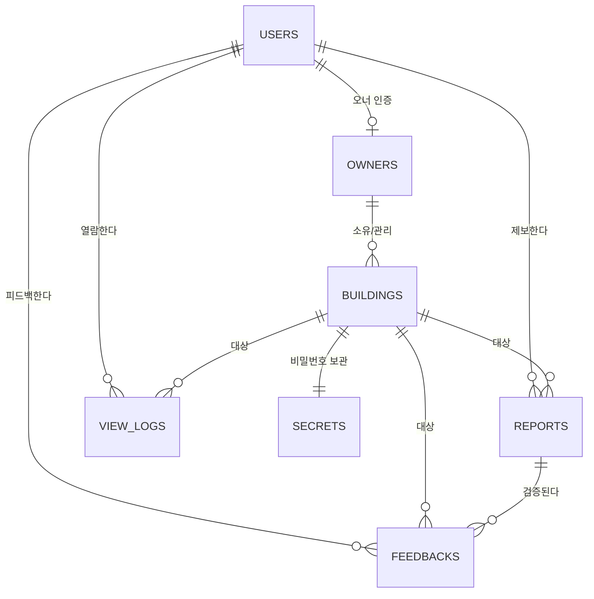

# ERD — Korea Toilet Sharing Service

> 데이터 모델 정의서 (Firestore 컬렉션 설계)
> 버전: 1.0

---

## 1. 개체 관계 다이어그램

## 2. 컬렉션 상세

### 2.1 `users/{uid}`
| 필드 | 타입 | 설명 |
|---|---|---|
| uid | string | Firebase Auth UID (문서 ID) |
| nickname | string | 표시 이름 (오너 로그에는 이것만 노출) |
| provider | 'google' \| 'kakao' | 로그인 수단 |
| phoneVerified | boolean | 휴대폰 본인인증 여부 (배지) |
| trustScore | number | 매너 점수 (기본 50, 0~100) |
| points | number | 기여 포인트 |
| freeReveals | number | 잔여 무료 열람권 (신규 3회) |
| etiquetteAgreedAt | timestamp | 에티켓 서약 시각 |
| locale | 'ko'\|'en'\|'zh'\|'ja' | 선호 언어 |
| createdAt / lastActiveAt | timestamp | |

### 2.2 `buildings/{buildingId}`
| 필드 | 타입 | 설명 |
|---|---|---|
| name | string | 빌딩명 (없으면 주소 요약) |
| address | string | 도로명 주소 |
| lat / lng | number | 좌표 |
| geohash | string | 반경 쿼리용 |
| toilets.male / toilets.female | map | 아래 Toilet 구조 |
| ownerId | string? | 인증 오너 UID |
| ownerVerified | boolean | 오너 인증 빌딩 여부 |
| isPublicByOwner | boolean | 오너 자발 공개 |
| status | 'active' \| 'disputed' \| 'hidden' | 신고/비공개 처리 상태 |
| createdBy / createdAt / updatedAt | | |

**Toilet 구조 (toilets.male 예)**
| 필드 | 타입 | 설명 |
|---|---|---|
| exists | boolean | 해당 성별 화장실 존재 여부 |
| locationDesc | string | "2층 계단 옆" 등 위치 설명 |
| hasPassword | boolean | 잠금 여부 |
| confidence | 'high'\|'medium'\|'low' | 대표 비밀번호 신뢰 등급 (캐시) |
| reportCount | number | 유효 제보 수 (캐시) |
| lastConfirmedAt | timestamp | 마지막 "맞았어요" 시각 (캐시) |

> ⚠️ 비밀번호 원문은 buildings에 저장하지 않는다 → `secrets` 분리.

### 2.3 `secrets/{buildingId}` — 서버 전용 read
| 필드 | 타입 | 설명 |
|---|---|---|
| male.current | string | 남자 화장실 대표 비밀번호 |
| male.candidates | array<{value, score}> | 합의 알고리즘 후보별 점수 |
| female.current / female.candidates | | 동일 구조 |
| ownerOverride.male / .female | string? | 오너 공식 등록값 (존재 시 최우선) |
| computedAt | timestamp | 마지막 재계산 시각 |

### 2.4 `reports/{reportId}` — 비밀번호 제보 (불변 로그)
| 필드 | 타입 | 설명 |
|---|---|---|
| buildingId | string | |
| gender | 'male' \| 'female' | |
| password | string | 제보된 비밀번호 |
| reporterId | string | |
| reporterVerified | boolean | 제보 당시 본인인증 여부 (가중치 W_reporter) |
| onsite | boolean | 제보 시 GPS 150m 이내 여부 (W_onsite) |
| reportedAt | timestamp | W_recency 계산 기준 |
| revoked | boolean | 신고 처리로 무효화 |

### 2.5 `viewLogs/{logId}` — 열람 기록 (서버만 create, 불변)
| 필드 | 타입 | 설명 |
|---|---|---|
| buildingId / gender | | 무엇을 열람했는가 |
| viewerId | string | 누가 |
| viewerNickname | string | 오너 노출용 스냅샷 |
| viewerPhoneVerified | boolean | 인증 사용자 여부 |
| viewedAt | timestamp | 언제 — "이 시각 사용으로 간주" |
| viewerLat / viewerLng | number? | 열람 시점 위치 |
| distanceM | number? | 빌딩과의 거리 (현장 여부) |
| revealedValue | string | 당시 보여준 비밀번호 (분쟁 대응) |

### 2.6 `feedbacks/{feedbackId}`
| 필드 | 타입 | 설명 |
|---|---|---|
| buildingId / gender | | |
| viewLogId | string | 어느 열람에 대한 피드백인지 |
| userId | string | |
| result | 'correct' \| 'wrong' | 맞았어요/틀렸어요 |
| createdAt | timestamp | |

### 2.7 `owners/{uid}` — 오너 인증 신청
| 필드 | 타입 | 설명 |
|---|---|---|
| businessRegNo | string | 사업자등록번호 |
| buildingIds | array<string> | 관리 빌딩 |
| status | 'pending' \| 'approved' \| 'rejected' | 관리자 승인 |
| appliedAt / reviewedAt | timestamp | |

### 2.8 `flags/{flagId}` — 신고
| 필드 | 타입 | 설명 |
|---|---|---|
| buildingId / gender | | |
| type | 'wrong_info' \| 'owner_optout' \| 'abuse' | |
| reporterId | string | |
| detail | string | |
| status | 'open' \| 'resolved' | open이면 해당 화장실 status='disputed' |

## 3. 인덱스

- `buildings`: geohash ASC (반경 쿼리), status
- `reports`: (buildingId, gender, reportedAt DESC)
- `viewLogs`: (buildingId, viewedAt DESC) — 오너 조회용 / (viewerId, viewedAt DESC) — 내 기록
- `feedbacks`: (buildingId, gender, createdAt DESC)

## 4. 접근 제어 매트릭스

| 컬렉션 | 비로그인 | 일반 사용자 | 오너(자기 빌딩) | 서버(Admin) |
|---|---|---|---|---|
| buildings | read | read / create | read / update(자기 것) | full |
| secrets | ❌ | ❌ (API 경유만) | ❌ (API 경유) | full |
| reports | ❌ | create, read(집계만) | read | full |
| viewLogs | ❌ | read(본인 것) | read(자기 빌딩) | create/full |
| users | ❌ | 본인만 | 본인만 | full |
| feedbacks | ❌ | create | read | full |
| flags | ❌ | create | create/read | full |
