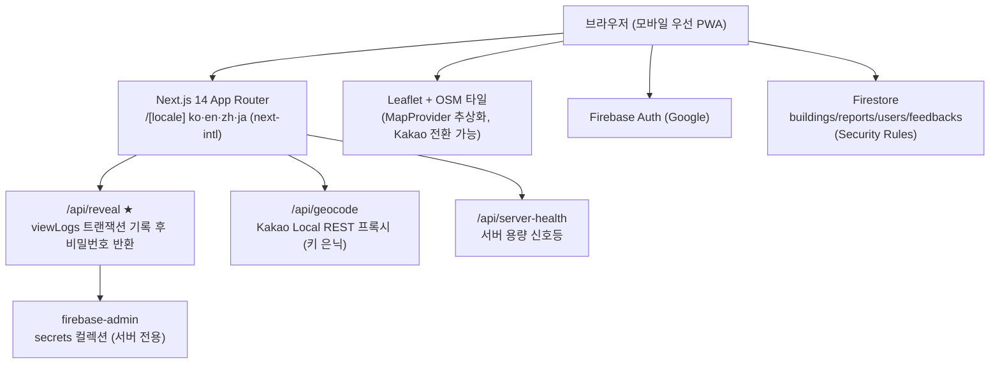

# TECH_STACK — Korea Toilet Sharing Service

> 한줄 요약: Next.js 14 + Firebase(Auth/Firestore) + Leaflet(OSM) + next-intl 4개 언어, "기록이 남는 신뢰 기반 열람" 웹앱
> 마지막 업데이트: 2026-07-19 · 머신용 데이터: [public/techstack.json](public/techstack.json)

## 아키텍처

## 카테고리별 스택

| 이름 | 버전 | 용도 | 위치 | 비고 |
|---|---|---|---|---|
| Next.js (App Router) | 14.2 | 프레임워크, Route Handler | `src/app/` | |
| TypeScript | 5 | 정적 타입 | 전체 | strict |
| Tailwind CSS | 3.4 | 스타일 | `tailwind.config.ts` | 브랜드 #2563EB |
| shadcn/ui 스타일 | - | UI 컴포넌트 | `src/components/ui/` | radix-dialog + cva 직접 구성 |
| Leaflet / react-leaflet | 1.9 / 4.2 | 지도 (OSM) | `src/components/map/MapView.tsx` | dynamic import ssr:false 필수 |
| geofire-common | 6 | geohash 반경 쿼리 | `src/lib/geo.ts` | 경계 셀 전체 순회 |
| next-intl | 3.26 | i18n (ko/en/zh/ja) | `src/i18n/`, `src/messages/` | 하드코딩 문자열 금지 |
| Firebase Auth | 12 | Google 팝업 + Kakao(인가코드→Custom Token) | `src/lib/firebase/client.ts`, `src/app/api/auth/kakao/` | Kakao 콘솔 Redirect URI 등록 필요 |
| Cloud Firestore | 12 | 데이터 저장 | ERD.md 참고 | secrets는 서버 전용 |
| firebase-admin | 14 | 서버 전용 열람/제보 API | `src/lib/firebase/admin.ts` | `FIREBASE_ADMIN_KEY` |
| Vitest | 4 | consensus 단위 테스트 | `src/lib/consensus.test.ts` | `npm test` |
| Vercel | - | 배포 (예정 T-604) | - | |

## 왜 이걸 골랐나

- **Leaflet+OSM 먼저**: API 키 없이 즉시 시작, `MapProvider` 인터페이스로 카카오맵 전환 여지 확보 (TRD §3.1)
- **secrets 컬렉션 분리 + /api/reveal 강제**: "로그 없는 열람 원천 봉쇄"가 제품의 핵심 원칙 (PRD §1.4)
- **대표 비밀번호를 buildings에 캐시**: Firestore 무료 티어 읽기 절감 (TRD §5)
- **next-intl**: 외국인 관광객 페르소나(PRD §2) 대응 — 4개 언어 라우팅이 미들웨어 하나로 해결

## 외부 의존 서비스 & 요금 영향

| 서비스 | 무료 한도 | 초과 시 |
|---|---|---|
| Firebase Spark | Firestore 읽기 5만/일 등 | 열람 API 레이트리밋 + Blaze 검토 |
| OSM 타일 | usage policy 준수 필요 | MapTiler 등 전환 |
| Kakao Local API | 일 쿼터 충분 | 쿼터 모니터링 |

## 알려진 한계

- 데모 모드(env 미설정)에서는 목업 데이터·가짜 비밀번호로 UX만 시연됨
- Kakao 로그인(T-202), 오너 대시보드(T-403~404), PWA(T-601), Rules 에뮬레이터 테스트(T-205 테스트 부분)는 미구현
- `users` 문서의 points/freeReveals 필드 클라이언트 변조 차단 Rules 필드 검증은 T-205에서 보강 필요
